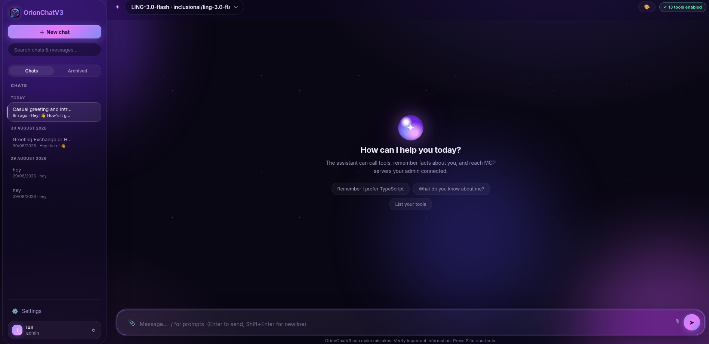

# OrionChatV3 ✦

A self-hosted chat for AIs (and humans) with streaming, tool calling, custom MCP servers, a per-user knowledge base, memory, and deep admin controls. **Zero dependencies** — runs on plain Node.js ≥ 22 (built-in `node:sqlite`, `node:http`, `node:crypto`). No npm install, no build step, no framework.



## Run

```bash
node server/server.js          # http://localhost:3000
PORT=8080 node server/server.js
```

**The first account you register becomes the admin.**

## Test

```bash
node --test test/server.test.js
```

The suite spawns the real server on an isolated data directory plus three mock helpers (a streaming OpenAI-compatible provider and two MCP servers, stdio + HTTP) and exercises auth (including TOTP 2FA), chat streaming, tool calling, the knowledge base, BYOK providers, quotas (global + per-user overrides), projects, scheduled tasks, impersonation, backups, admin, shares, the `/v1` API, and the frontend assets — 87 tests, including a unit pass over the markdown renderer (tables, task lists, XSS escaping).

## Security notes

- Passwords are salted + hashed with scrypt; sessions are HttpOnly cookies with a configurable lifetime; auth endpoints are rate limited.
- Message content is rendered by an escaping-first markdown renderer; share pages sanitize the same way.
- Security-relevant actions land in a filterable audit log; impersonation and force-logout are admin-only and audited.
- 2FA challenges are single-use, expire in 5 minutes, and never set a session cookie before the code is verified.
- Chat routes (including `/v1/chat/completions`) are rate limited per user and enforce per-user daily quotas.
- Artifact previews run in a sandboxed iframe (`allow-scripts`, no same-origin); backup downloads validate names against path traversal.

## Features

**Chat**

- **Multi-provider chat** — admin presets for OpenRouter, Anthropic, OpenAI, DeepSeek, Ollama (local), Ollama Cloud, SpaceXAI, and any custom OpenAI-compatible endpoint. Anthropic uses its native Messages API; everything else uses the OpenAI chat-completions format with tool calling. Provider connections can be tested from the admin panel, with optional $/Mtok pricing that powers personal cost estimates.
- **Bring your own provider** — users add their own OpenAI-compatible or Anthropic keys under 🧩; personal providers appear only in their model picker (marked 🧩) and on `/v1/models` as `orion-u<id>`. Admins gate the whole feature and cap it per user.
- **Streaming** — replies stream token-by-token over SSE with a live stop button; regenerate swaps in a fresh answer — optionally **with a different model** ("Retry with…" picker), and the choice sticks to the chat. Open chats self-refresh across devices, and a chime / title-flash / desktop notification tells you when a reply lands while you're away. Tool chips show execution time; assistant replies are tagged with the model that produced them.
- **Tool calling loop** — the model can call tools (up to 8 rounds per message) and results are fed back automatically. Tool calls render as inline events in the transcript; the 🔧 badge lists every tool the AI can currently see.
- **Knowledge base (RAG-lite)** — users upload text documents under 🗂; they're chunked and indexed locally, the AI searches them with `knowledge_search` whenever a question touches their content, and a live search box shows exactly what it sees.
- **Per-conversation persona** — custom system prompt and temperature per chat (🎛), a persona picker fed by the admin's shared persona library, and **projects** that group chats under a shared persona (🗂 strip in the sidebar, new chats auto-assigned while a project is selected).
- **Private chats** — mark any chat private (🕶) and the AI can neither read your memories nor save new ones in it; other chats are unaffected.
- **Vision** — attach, drag-drop, or paste images (PNG/JPEG/GIF/WebP); they ride along as vision input for capable models on both OpenAI and Anthropic providers.
- **File attachments** — text files ride along in the prompt every turn.
- **Voice** — speech-to-text in the composer (🎙, where the browser supports it) and read-aloud on every assistant reply (🔊).
- **Artifacts** — HTML/SVG code blocks get a ▶ preview button: a sandboxed live-render side panel with an edit-and-rerun editor and open-in-tab.
- **Prompt library** — save reusable prompts and insert them with `/` when the composer is empty (built-ins `/summarize` and `/continue` included).
- **Recency-aware sidebar** — chats sort by their latest message (pinned stay on top), forks inherit the project and persona, and the theme picker can return to "follow system".
- **Search & filter** — search across chat titles and message content from the sidebar with multi-term (AND) matching and click-to-jump; conversations group under Today/Yesterday/day headers, and a 🔍 filter bar narrows long chats to matching messages in place.
- **Starred messages** — ☆ any message and revisit them from the ⭐ panel, which jumps back and flashes the message.
- **Reminders** — schedule a prompt for later (⏰); a background scheduler runs it and drops the answer into a new chat.
- **Conversation management** — pin, archive, rename (auto-titling can be switched off), fork (branch from any point), edit your messages (later messages regenerate) or correct assistant replies in place, export as Markdown/JSON/HTML, copy the whole chat as text, import a chat from JSON **or a Markdown transcript**, and share a read-only public link (🔗, revocable) with markdown rendering and a light/dark toggle.
- **Learns about users** — every chat injects the user's saved memories into the system prompt, and the model is instructed to persist new facts with `memory_save`. Users can view/forget memories via the 🧠 panel, switch memory off for their whole account, and set standing custom instructions (📝). Admins can gate memory platform-wide or per user.
- **Drafts** — half-typed messages survive switching chats and page reloads.

**Look & feel**

- **Twelve themes** — Orion (galaxy dark, default), Prime (Optimus red & blue, with his words on the welcome screen — dedicated to Peter Cullen, 1941–2026, the voice of Optimus Prime), Nebula (deep space), Aurora (emerald night), Ember (warm dusk), Ocean (deep-sea cyan), Midnight (near-black), Bloom (rose garden), Graphite (monochrome), Daybreak (light), Meadow (green morning, light), and Solar (amber light). Open the 🎨 picker in the header; your choice is remembered, and until you pick one the app follows your OS light/dark preference. Each theme restyles the whole UI — nebula backdrop, starfield, code syntax colors, bubbles — and mobile browser chrome follows via `theme-color`.
- **Rich markdown** — tables, task lists, headings, blockquotes, strike/highlight, code blocks with copy buttons and syntax highlighting.
- **Command palette** — `Alt+K` jumps to any chat, panel or action.
- **Settings menu** — one ⚙️ entry in the sidebar groups every panel (instructions, prompts, memories, documents, reminders, stars, usage, personal providers, MCP tools, account) so the chat list keeps the room.
- **Keyboard shortcuts** — `Ctrl/⌘+Shift+O` new chat · `Ctrl/⌘+K` search · `Alt+K` palette · `/` prompts · `Ctrl/⌘+Enter` send · `?` help · `Esc` close.
- **Long-chat tools** — an outline dropdown jumps between your questions in a long chat, a 🔍 filter narrows messages by text and role, and auto-scroll pauses when you scroll up to read.
- **Reply niceties** — assistant replies carry model chips and token counts, tool chips show execution time, half-typed drafts survive chat switches, and starred messages export as Markdown.
- **Mobile & PWA** — off-canvas sidebar on phones, full-screen sheets, safe-area insets; installable via a web manifest with an offline app shell (service worker; API calls are never cached).
- **First-visit tour** — a five-step walkthrough of search, models, attachments, themes and the document library.
- **Usage stats** — 📊 shows chats, messages, tokens, today's quota, estimated spend and a 14-day chart.
- **Print stylesheet** — printing a chat produces a clean transcript.
- **Accessible shell** — labelled controls, a skip link, keyboard focus rings, and an `aria-live` toast region.
- **Announcements** — admins broadcast dismissible banners with severity (info/warning/critical) and optional expiry.

**Platform**

- **Accounts & roles** — register/login with session cookies; profile with display name and avatar color; login-lifetime configurable in days; auth endpoints are rate limited.
- **Two-factor auth** — TOTP (RFC 6238, works with any authenticator app). Setup from the 👤 account panel; on login the password only yields a short-lived challenge (5-minute expiry, single use) and the 6-digit code completes it. The admin panel shows a 2FA badge per user.
- **Built-in tools (admin can toggle each)**: `memory_save`, `memory_recall`, `get_time`, `calculator`, `web_search`, `web_fetch`, `random_number`, `uuid4`, `base64_convert`, `hash_text`, `text_stats`, `json_format`, `knowledge_search`.
- **Admin MCP servers** — **stdio** servers (command + JSON args + env lines) or **HTTP** servers (MCP Streamable HTTP + optional headers). Tools are namespaced `server__tool` so names never collide; connections are persistent and self-restarting, with test/restart buttons, per-tool enable/disable, and resource/prompt-template discovery.
- **Personal MCP servers** — users connect their own MCP tools from the 🔌 My tools panel; they're namespaced `u<id>__tool` and join that user's chats. Admins gate the whole feature, cap servers per user, and can pause every personal server at once.
- **Daily quotas** — a global per-user daily message limit with per-user overrides (custom limit / unlimited / blocked), enforced on every chat route including `/v1`; a blocked chat shows exactly when the quota resets.
- **Admin analytics** — messages/tokens/chats per day (30 days), hour-of-day activity, model mix, per-user totals (with last activity and feature counts), and a live system panel (uptime, memory, DB size, MCP connection health, pending tasks).
- **Audit log** — security-relevant activity (logins, failed logins, 2FA, admin changes, shares, key rotations, impersonation, backups) filterable by action.
- **Admin platform settings** — open/close registration, master memory switch (global and per user), personal-MCP and personal-provider gates with per-user caps, document library gate and cap, daily message limit with per-user overrides, login lifetime, direct user creation, impersonation and force-logout (both audited), announcements, **server-side JSON backups** (create/list/download/delete, the 10 most recent kept), and full data export.
- **Data ownership** — one-click export of everything belonging to you (chats, attachments, prompts, memories, documents, projects) as JSON, plus self-service account deletion with password confirmation.
- **API access for AIs** — every user gets an API key (`oc_…`, with an in-app playground). AIs can call `POST /api/chat`, `GET /api/tools`, and the full REST surface with `Authorization: Bearer oc_…` — no browser needed.
- **OpenAI-compatible endpoint** — `POST /v1/chat/completions` (streaming included) and `GET /v1/models` let any OpenAI SDK talk to your OrionChatV3 models via `model: orion-<providerId>` (shared pool) or `orion-u<id>` (personal).
- **Data ownership** — one-click export of everything belonging to you (chats, attachments, prompts, memories, documents, projects) as JSON.
- **Health & ops** — `GET /api/health` reports version and row counts; admins can export the entire database (minus password hashes) as JSON.
- **Update checker + one-click self-update** — the admin panel compares the running version against this repository (cached for an hour). When a newer `VERSION` is on GitHub, **⬇ Update now** fast-forwards the git checkout (`fetch` + `merge --ff-only`, refusing dirty trees), restarts the server in place (graceful drain → detached respawn → port-retry), and reloads the app once the new process answers. A **↻ restart** button covers manual `git pull` too.

## API quick reference

| Endpoint | Description |
|---|---|
| `POST /api/register` / `POST /api/login` / `POST /api/login/totp` / `POST /api/logout` | Auth (session cookie, optional 2FA step) |
| `GET /api/me` · `PUT /api/settings` · `POST /api/password` | Account, profile & preferences |
| `GET /api/me/stats` · `GET /api/me/starred` · `GET /api/me/export` · `GET /api/me/sessions` | Personal stats, stars, data export, active sessions |
| `POST /api/2fa/setup` · `/enable` · `/disable` | TOTP two-factor auth |
| `POST /api/chat` · `POST /api/chat/stream` · `POST /api/chat/regenerate` | Chat (JSON / SSE) |
| `GET /api/tools` | Effective tool list (built-ins + MCP) |
| `GET /api/conversations` · `POST /api/conversations` · `POST /api/conversations/import` · `DELETE /api/conversations` | Conversation CRUD + import (`?project=` filter) |
| `POST /api/conversations/rename` · `/fork` · `/share` · `PUT /api/conversation/flags` · `PUT /api/conversation/settings` | Per-chat actions |
| `GET /api/conversation/:id/messages` (supports `?after=` / `?before=` cursors) · `PUT /api/messages` · `PUT /api/messages/star` | History & edits |
| `GET /api/search?q=…` | Full-text search across chats |
| `GET/PUT/DELETE /api/memories` | Per-user memory store |
| `GET/POST/DELETE /api/documents` · `GET /api/documents/search` | Knowledge base |
| `GET/POST/PUT/DELETE /api/my/providers` · `POST /api/my/providers/test` | Personal BYOK providers |
| `GET/POST/PUT/DELETE /api/mcp` | Personal MCP servers (add, enable/disable, test, remove) |
| `GET/POST/PUT/DELETE /api/projects` | Chat groupings with shared personas |
| `GET /api/personas` | Shared persona library |
| `GET/POST/DELETE /api/tasks` | Scheduled prompts (reminders) |
| `GET/POST/PUT/DELETE /api/prompts` | Prompt library |
| `GET/POST/DELETE /api/conversations/attachments` | Chat attachments (text + vision images) |
| `GET /api/personas` | Shared persona library (see also projects) |
| `GET/POST/DELETE /api/tasks` | Scheduled prompts (reminders), optional provider pin |
| `POST /api/conversations/clear` | Wipe a chat's messages, keep the chat |
| `GET /api/announcements` · `POST /api/admin/announce` | Broadcast banner (severity + expiry) |
| `GET /api/admin/overview` · `GET /api/admin/stats` · `GET /api/admin/system` · `GET /api/admin/audit` · `GET /api/admin/export` | Admin stats, vitals, audit trail, full export |
| `POST /api/admin/backup` · `GET /api/admin/backup` · `GET /api/admin/backup/download?name=` · `DELETE /api/admin/backup?name=` | Server-side JSON backups |
| `POST /api/account/delete` | Self-service account deletion (password confirmed) |
| `POST /api/admin/providers` · `mcp_servers` · `mcp_test` · `mcp_restart` · `provider_test` · `tool_settings` · `settings` · `users` · `personas` | Admin mutations (incl. pricing, platform settings, create user, impersonate, quotas) |
| `GET /v1/models` · `POST /v1/chat/completions` | OpenAI-compatible API (Bearer `oc_…`) |
| `GET /api/health` | Liveness + counts |

## Example: add an MCP server

Admin → ⚙️ → "Add MCP server". Two transports are supported:

**stdio (local process)**

- name: `filesystem`
- command: `node`
- args: `["/path/to/mcp-filesystem-server.js","/tmp"]`

**HTTP (remote server — MCP Streamable HTTP)**

- name: `remote`
- url: `https://example.com/mcp`
- headers (optional, one per line): `Authorization: Bearer sk-…`

Tool handling:

- Tools are namespaced as `server__tool`, so two servers exposing the same tool name never collide.
- Click any tool tag on a server card to enable/disable it for chats.
- Connections are persistent: stdio processes are reused across requests and automatically restarted if they die; `test` and `restart` buttons show live state, and each card reports its tool list, resources and prompt templates, plus errors.

## Example: call OrionChatV3 from an OpenAI SDK

```js
import OpenAI from 'openai'; // any OpenAI-compatible client works

const client = new OpenAI({
  baseURL: 'http://localhost:3000/v1',
  apiKey: 'oc_your_key_here',           // from the 👤 account panel (copy / rotate per user)
});
const res = await client.chat.completions.create({
  model: 'orion-3',                     // orion-<providerId> (shared) or orion-u2 (personal)
  messages: [{ role: 'user', content: 'What tools do you have?' }],
});
```

## Layout

```
VERSION            Release version — the update checker compares it with GitHub
server/server.js   HTTP API, chat orchestration, built-in tools, knowledge base,
                   quotas, audit, TOTP, scheduler, auth, share pages
server/mcp.js      Minimal MCP client (JSON-RPC 2.0 over stdio & Streamable HTTP)
public/            Single-page frontend (app.js, markdown.js, style.css, logo.png,
                   manifest.webmanifest, sw.js)
test/              End-to-end suite + mock provider/MCP helpers
data/              SQLite database + backups/ (JSON snapshots, created on demand)
```
